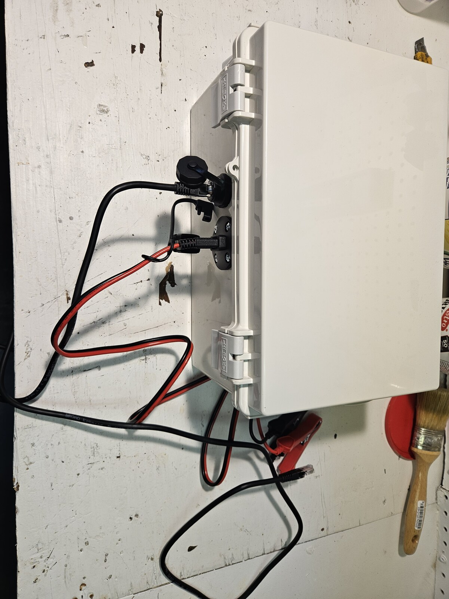
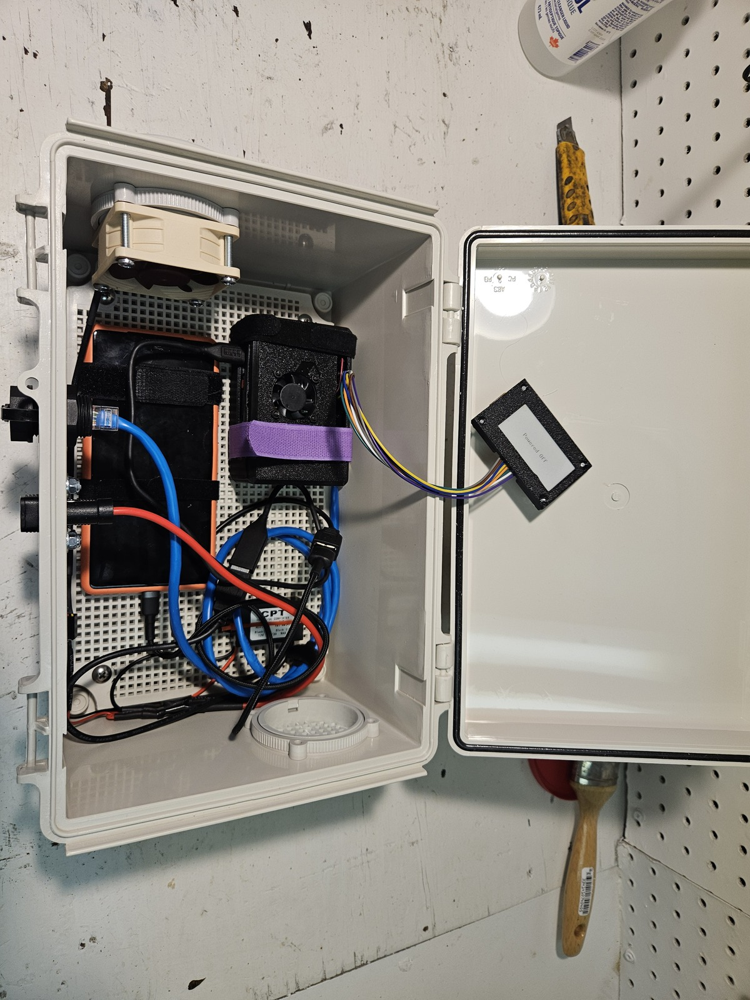

# SBC Deployment Guide

## Overview

These files help deploy the rt-forwarder to a Raspberry Pi. The recommended
path is the server UI's **SBC Setup** wizard: it creates the forwarder enrollment
token, generates the cloud-init files, and embeds an automatic first-boot setup
run. Under the hood, cloud-init provisions the OS baseline (hostname, SSH keys,
system user, required packages), then `rt-setup.sh` downloads the forwarder
binary, writes configuration, and installs the systemd service.

## Prerequisites

- Raspberry Pi 3, 4, or 5 running a 64-bit OS
- An SD card (16 GB+ recommended)
- [Raspberry Pi Imager](https://www.raspberrypi.com/software/) 2.0 or later
- A computer on the same network as the Pi
- Access to the server UI as an operator/admin

## Example Field Enclosure

The forwarder can run on a bare Raspberry Pi, but the field build used for
race deployments is a self-contained enclosure. The goal is to power the
forwarder from the same kind of 12 V battery workflow used for IPICO readers,
protect the Pi and wiring, and support local status visibility without opening
the box in a future lid-mounted display revision.





The field enclosure uses or plans for these parts:

| Part | Role |
|---|---|
| Raspberry Pi | Runs `rt-forwarder` on Raspberry Pi OS Lite. |
| [PiSugar 3 Plus UPS](https://www.amazon.ca/dp/B0FBK89B8H) | Provides a local UPS HAT so brief power interruptions do not immediately stop the forwarder. The setup script can install and enable PiSugar monitoring when UPS support is selected. |
| [Waveshare 2-inch SPI LCD, 240×320](https://www.amazon.ca/dp/B081NBBRWS) | Recommended local status display for a future lid-mounted revision. It connects over SPI, and SBC release builds include LCD display support. |
| 3D-printed PiSugar/Raspberry Pi case | Holds the Pi and UPS inside the enclosure; this build was modified slightly to fit the small Pi fan. |
| [Easycargo 30 mm Raspberry Pi fan set](https://www.amazon.ca/dp/B0792BW2VH) | Small fan for the Pi/PiSugar case. |
| [Noctua NF-A6x25 FLX 60 mm fan](https://www.amazon.ca/dp/B009NQMESS) | Larger enclosure fan for airflow, powered from the 5 V DC-DC converter. |
| [Molex 4-pin to dual XH2.54 fan splitter](https://www.amazon.ca/dp/B0FJ1XNZJ4) | Fan power lead/adaptation inside the enclosure. |
| [Bud Industries NBF-32018 ABS enclosure](https://www.digikey.ca/en/products/detail/bud-industries/NBF-32018/2328538) | Hinged IP66/NEMA-rated enclosure body. |
| [Bud Industries NBX-32916-PL ABS inner panel](https://www.digikey.ca/en/products/detail/bud-industries/NBX-32916-PL/2676747) | Plastic internal mounting panel for the electronics, phone, and cable-tie anchors. |
| [Bud Industries IPV-1115 vent](https://www.digikey.ca/en/products/detail/bud-industries/IPV-1115/4896963) | Vent hardware used with the enclosure. |
| [ACEIRMC IP67 RJ45 panel-mount couplers](https://www.amazon.ca/dp/B0CFV1WM1Z) | Weather-resistant Ethernet bulkhead feed-throughs. |
| [12 V to 5 V dual USB DC-DC converter](https://www.amazon.ca/dp/B07GC1NB43) | Converts the external 12 V battery input to 5 V USB power for the Pi/UPS path. |
| [SAE panel-mount sidewall port](https://www.amazon.ca/dp/B07S91KPQB) | External 12 V battery input connector on the enclosure. |
| [SAE to battery alligator clip cable](https://www.amazon.ca/dp/B0F1F51QTJ) | Connects the enclosure to a 12 V battery in the field. |
| Second-hand Pixel phone with low-cost eSIM plan | Provides a dedicated cellular hotspot when wired internet or trusted Wi-Fi is not available. |

Typical field power path:

```text
12 V battery
  -> SAE alligator-clip lead
  -> SAE panel-mount enclosure port
  -> 12 V to 5 V DC-DC converter
     -> PiSugar UPS / Raspberry Pi
     -> enclosure fan
```

> **Power warning:** Check polarity before connecting the battery, add
> appropriate fuse protection for your battery setup, and strain-relieve
> external cables so the enclosure connectors do not carry cable weight. SAE
> connectors are not always wired with the same polarity convention. Size the
> DC-DC converter for the Pi model plus any phone charging and fan load. If
> powering a fan from the converter output, verify that the fan starts reliably
> at that voltage.

Build notes from this enclosure:

- Velcro cable ties were zip-tied to the plastic inner panel to hold the
  Raspberry Pi and hotspot phone in place. This keeps the devices from sliding
  around if the enclosure is shaken, dropped, or transported between timing
  points.
- The enclosure is intended to handle field weather such as wind and rain, but
  temperature remains a practical limit. Battery performance and electronics
  cooling both constrain the usable operating range; the enclosure fan helps
  move air, but it does not remove those limits. Operating much below freezing
  can hurt battery performance, although heat retained inside the enclosure may
  reduce the impact in some conditions.
- The recommended Waveshare LCD screen is not mounted in this build. A future
  lid-mounted version could cut an opening in the lid, mount the display behind
  it, and cover the opening with acrylic so operators can read status without
  opening the box. The pictured lid display is from a prototype display setup,
  not the recommended LCD mounting.
- The enclosure was chosen because it is rigid, discreet, easy to modify, and
  light-coloured enough to reduce heat gain in sun compared with a dark box.

The final weather resistance depends on how the ports, vents, display, and
cable penetrations are installed.

## Step 1 -- Flash the SD Card

1. Open Raspberry Pi Imager.
2. Choose **Raspberry Pi OS Lite (64-bit)** as the operating system. The "Lite"
   variant is recommended because the forwarder runs headless -- no desktop
   environment is needed.
3. Select your SD card as the target storage device.
4. Click **Write** and wait for the flash to complete.

## Step 2 -- Generate cloud-init Files

Use the server UI's **SBC Setup** page as the normal path. It is easier than
running the local Python helper because it creates the forwarder enrollment token
and inserts the one-time secret into the setup form for you.

1. Open the server UI and go to **SBC Setup** (`/sbc-setup`).
2. In **Token management**, generate a forwarder token. Copy it immediately or
   click **Use in setup form**.
3. Fill in the device identity, network settings, server URL, reader targets,
   display name, and UPS option.
4. Download both generated files:
   - `user-data`
   - `network-config`
5. Copy both files to the SD card's **boot** partition. Keep the exact filenames
   with no extension.

Files generated by the server UI embed an automatic first-boot `rt-setup.sh`
run. On first boot, the Pi installs the forwarder, writes the config, enables
the local web UI, and registers with the server using the generated enrollment
token. A server operator still needs to approve the newly registered forwarder
before receivers can use it.

> **Why this matters:** Raspberry Pi OS no longer guarantees a default `pi`
> login user. The generated cloud-init file writes an explicit SSH admin user so
> SSH access is deterministic.
> See: [Raspberry Pi April 2022 update](https://www.raspberrypi.com/news/raspberry-pi-bullseye-update-april-2022/)
> and [Raspberry Pi OS customization docs](https://www.raspberrypi.com/documentation/computers/configuration.html#configuring-a-user).
>
> **Security note:** automatic first boot stores the forwarder enrollment token
> in cloud-init data on the SD card. Use scoped tokens and revoke unused tokens
> from the server UI.
>
> **Network trust model:** LAN-accessible unauthenticated status/control endpoints
> are expected in this deployment model. Treat the forwarder network as trusted
> infrastructure (for example private VLAN / physically controlled LAN only).

<details>
<summary>Alternative: generate files with the local Python helper</summary>

From the repository root:

```bash
uv run scripts/sbc_cloud_init.py --auto-first-boot
```

The script asks for hostname, SSH admin username, SSH key, static IP settings,
DNS servers, optional Wi-Fi settings, server URL, enrollment token, reader
targets, and status bind address. It then writes ready-to-copy `user-data` and
`network-config` files.

Use this path only when the server UI is unavailable. You must create or obtain
the forwarder enrollment token separately.

</details>

<details>
<summary>Alternative: edit cloud-init files manually</summary>

1. Open `deploy/sbc/user-data.yaml` from this repository in a text editor.

2. Change the values marked **CHANGEME**:

   - **`hostname`** -- set a unique name for this device (e.g. `rt-fwd-01`,
     `rt-fwd-02`).
   - **SSH admin `users[].name`** -- set the login username you will SSH as
     (for example `rt-admin`).
   - **SSH admin `users[].ssh_authorized_keys`** -- replace the placeholder
     key. You can find your key with:

     ```bash
     cat ~/.ssh/id_ed25519.pub
     # or
     cat ~/.ssh/id_rsa.pub
     ```

3. Open `deploy/sbc/network-config` and edit networking settings:

   - **`addresses`** -- the static IP for this Pi (default: `192.168.1.50/24`).
   - **`routes` → `via`** -- the default gateway (default: `192.168.1.1`).
   - **`nameservers`** -- DNS servers (default: `8.8.8.8`, `8.8.4.4`).
   - **Optional Wi-Fi** -- under `wifis.wlan0`, set `regulatory-domain`, SSID
     under `access-points`, and `password` if needed.

4. Copy both files to the SD card's **boot** partition:

   - `user-data.yaml` → `user-data` (no extension)
   - `network-config` → `network-config` (no extension)

Manual files do not include the one-time setup run unless you add it yourself.
Use Step 4 after boot.

</details>

> **Tip:** Some versions of Raspberry Pi Imager can apply cloud-init settings
> directly in the UI -- check under the advanced/customization options.

## Step 3 -- Boot, Connect, and Approve

If you used the server UI's generated files, boot the Pi and wait 2--3 minutes.
The forwarder install/config is applied automatically via cloud-init on first
boot. SSH is optional for troubleshooting only.

1. Insert the SD card into the Pi and power it on.
2. Wait approximately **2 minutes** for the first boot and cloud-init to finish.
3. Open the forwarder dashboard at `http://<hostname>.local` (include `:<port>`
   if you configured a non-default status bind). If the generated setup values
   are correct, the device should be ready to operate from the local web UI.
4. In the server UI, open **Device approval** (`/admin`) and approve the pending
   forwarder. Receivers cannot use the forwarder until it is approved.

For troubleshooting, connect via SSH using the static IP you configured in
`network-config` and the SSH admin username from `user-data`:

   ```bash
   ssh <ssh-admin-username>@<static-ip-from-network-config>
   ```

   For example, if you kept the default username `rt-admin` and default IP:

   ```bash
   ssh rt-admin@192.168.1.50
   ```

   The Pi advertises its hostname via mDNS (avahi-daemon), so you can also
   connect by name:

   ```bash
   ssh <ssh-admin-username>@<hostname>.local
   ```

## Step 4 -- Run the Setup Script Manually

Skip this step when you used files generated by the server UI or the local
Python helper with `--auto-first-boot`. `rt-setup.sh` already ran automatically
during first boot.

You have two options:

### Option A -- Download and run directly

```bash
curl -fsSL https://raw.githubusercontent.com/iwismer/rusty-timer/main/deploy/sbc/rt-setup.sh -o rt-setup.sh
sudo bash rt-setup.sh
```

### Option B -- If you cloned the repo

```bash
sudo bash deploy/sbc/rt-setup.sh
```

The setup script downloads both the release archive and its `.sha256` file,
then verifies the checksum before installing.

The wizard will prompt you for:

| Prompt | Example | Notes |
|---|---|---|
| Server URL | `https://server.example.com` | Must start with `http://` or `https://` |
| Auth token | *(hidden input)* | Enrollment voucher used to register with the server and mint a per-device token |
| Reader target(s) | `192.168.1.100:10000` | IP:PORT of each IPICO reader; enter one per line, blank line to finish |
| Status HTTP bind address | `0.0.0.0:80` | Press Enter to accept the default |
| PiSugar UPS | `y` | Optional. Installs PiSugar support, enables I2C, asks for shutdown settings/model, and adds `[ups]` monitoring to the forwarder config. |

SBC setup writes this control block by default:

```toml
[control]
allow_power_actions = true
allow_remote_config = true
```

`allow_power_actions` enables the config UI actions for restarting/shutting
down the device. The setup script installs
`/etc/polkit-1/rules.d/90-rt-forwarder-power-actions.rules` when
`[control].allow_power_actions = true`, and removes it when
`[control].allow_power_actions = false`.

`allow_remote_config` lets the server push configuration changes to the
forwarder. It is provisioned `true` by default to keep field devices remotely
manageable.

For non-interactive installs:

- Set `RT_SETUP_ALLOW_POWER_ACTIONS=0` to disable power actions. This flag
  fails safe to `false` on an unrecognized value.
- Set `RT_SETUP_ALLOW_REMOTE_CONFIG=0` (or `false`/`no`/`off`) to disable
  remote config. Because the product default is on, an unrecognized value
  falls back to the default (`true`) rather than disabling the feature;
  disabling requires an explicit recognized falsey value.
- Set `RT_SETUP_UPS_ENABLED=1` when installing non-interactively on a build
  with a PiSugar UPS. The script installs `pisugar-server`, enables I2C, and
  writes an `[ups]` section with `enabled = true` to the forwarder config.
  Optional UPS knobs are `RT_SETUP_UPS_MODEL` (default: `PiSugar 3`),
  `RT_SETUP_UPS_SHUTDOWN_LEVEL` (default: `5`), and
  `RT_SETUP_UPS_SHUTDOWN_DELAY` (default: `30`).

Power-action control endpoints are intentionally unauthenticated on the
forwarder; this is expected for trusted-LAN SBC deployments.

## Step 5 -- Verify

The setup script runs verification automatically after installation. If you
choose not to restart an already-running service, the script skips verification
and prints follow-up commands to run after restart.

You can also check manually at any time:

```bash
# Check the service is running
sudo systemctl status rt-forwarder

# Hit the health endpoint
curl http://localhost/healthz

# Follow logs in real time
journalctl -u rt-forwarder -f
```

## Updating the Forwarder

Use the forwarder web UI for normal updates. Open the local forwarder dashboard,
use the update controls to check/download/apply the new version, and let the UI
restart the forwarder when prompted. You do not need to SSH into the Pi or rerun
setup scripts for normal updates.

<details>
<summary>Fallback: manual update paths</summary>

If the web UI is unavailable, use one of these fallback paths:

- **Re-run the setup script.** Answer **yes** when asked to re-download the
  binary, and **no** when asked to overwrite the existing configuration.

  ```bash
  sudo bash rt-setup.sh
  ```

- **Manual update.** Download the new `forwarder-*-aarch64-unknown-linux-gnu.tar.gz` from
  [GitHub Releases](https://github.com/iwismer/rusty-timer/releases), extract
  it, copy the binary to `/usr/local/bin/rt-forwarder`, and restart the service:

  ```bash
  sudo systemctl restart rt-forwarder
  ```

</details>

When the forwarder self-updater stages an artifact at
`/var/lib/rusty-timer/.forwarder-staged`, `systemd` applies it automatically on
the next restart via `/usr/local/lib/rt-forwarder-apply-staged.sh`.

On SBC installs, `POST /update/apply` is configured to restart the forwarder
process (instead of in-process binary replacement). The root-owned
`ExecStartPre` hook then atomically promotes the staged binary before startup.

## Configuration Reference

See [`docs/runbooks/forwarder-operations.md`](../../docs/runbooks/forwarder-operations.md)
for full configuration options and operational procedures.

## Troubleshooting

| Problem | Cause | Solution |
|---|---|---|
| Can't SSH into Pi | cloud-init still running, wrong SSH username, or wrong hostname | Wait 2--3 minutes after boot. Use the SSH admin username configured in `user-data` (wizard default: `rt-admin`). Try the IP address instead of the hostname. |
| Setup script fails: "missing required commands" | One or more required tools are missing (`curl`, `jq`, `tar`, `sha256sum`) | Run `sudo apt-get install -y curl jq tar coreutils` |
| Setup script fails to download binary | No internet access on Pi | Check the network connection. Ensure the Pi can reach the internet. |
| Forwarder won't start | Bad config or unreachable readers | Check logs: `journalctl -u rt-forwarder -n 50` |
| "permission denied" errors | Script not running as root | Run with `sudo bash rt-setup.sh` |
| Forwarder starts but no receiver gets events | Wrong server URL, voucher/device token, or allow-list | Verify `p2p.server_url` in `/etc/rusty-timer/forwarder.toml`, check the token files in `/etc/rusty-timer/forwarder.token` and `/var/lib/rusty-timer/p2p-device-token`, and confirm receiver allow-list entries on the server. |
| Can't reach Pi after setting static IP | Wrong subnet or IP conflict | Verify the IP/subnet in `network-config` matches your network. Check for IP conflicts. Connect a monitor to see boot logs. |
